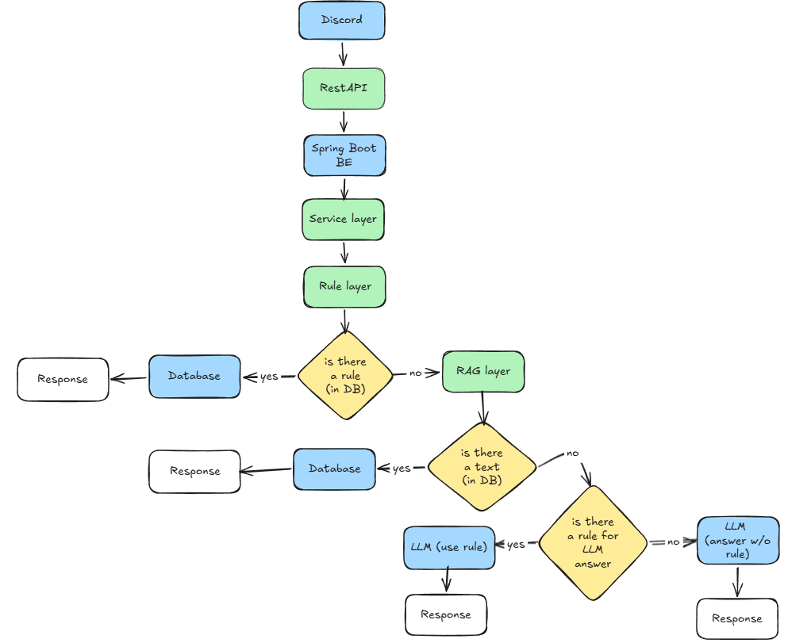

# Vestlusrobot juhi küsimustele vastamiseks

Vestlusrobot, mis vastab juhi klassikalistele küsimustele, kui sul on kiire – asjad, mida juhid võiksid tegelikult küsida ka AI-lt.

---

## Näited küsimustest:
- **Kust ma leian Amadeus API dokumentatsiooni?**
- **Mis tüüpi koordinaate ArcGISis kasutada saab?**
- **Mis on selle lahenduse üldine arhitektuur?**

Robot aitab kiirete küsimustega toime tulla, et arendajad saaksid keskenduda oma tööle ja juhid saaksid kiirelt vastuse.

---

## Tehniline stack
- **BE:** Java (tulevikus - mitte sellel kursusel - plaan minna Pythonile)
- **FE:** ReactJS (NextJS ?) + Discord (kui jääb aega)
- **AI:** OpenAI (mõni sent / 1000 lühivastust)

---

## BE
- Java (Spring Boot)
    - Sõnumite töötlemine
    - Loogika ja reeglid (osa reegleid ka FE-sse)
    - AI-ga suhtlus
    - Turvalisus

---

## Frontend
- ReactJS FE

## Täiendav
- Discord bot (tasuta, lihtne, hea prototüübiks)

---

## AI kasutamine
- **Kasutame OpenAI API chatbotti „mõtlemismootorina“**
- Defineerime reeglid AI vastuste jaoks

### AI kasutatakse näiteks:
- Kui küsimus on üldisem
- Kui see ei sobi ühegi kindla reegli alla (saame ka ise luua osad vastused / reeglid)

---

## Arhitektuur
### MVP:
1. React / JS
2. RestAPI → Spring Boot backend
3. OpenAI API → Response

### Kui jääb aega üle:
- Võib lisada Discordi boti
- Liquibase
- Mongo DB
- Redis (kui tahame cache'da)

---

### Enne OpenAI poole pöördumist:
- Läbime n-ö rule-based layer’i:
    - Tüüpvastused, mida saaks ilma OpenAI-ta vastata (vähendab kulusid)
    - Konkreetsete vastuste kasutamine vähendab AI hallutsinatsioone ja mittekompetentsete vastuste ohtu
    - RAG (lugemisega täiendatud genereerimine / allikapõhine genereerimine)
---

### Data flow simplified diagram:

 

    - Küsimus → Olemasolevad dokumendid → Anname need AI-le → AI vastab nende põhjal

---

## Cost Control
- **AI reeglid:**
    - Lühikesed promptid (short system prompt)
    - Seada limiit `max_token` (nt 500)
    - Reeglite layer esmalt!

- **Loogika vastamisel:**

  ```text
  if (ruleMatch) → return ruleAnswer
  else if (ragMatchWithConfidence) → return ragAnswer
  else → call LLM fallback
  ```
